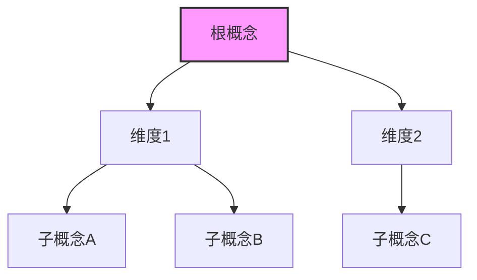
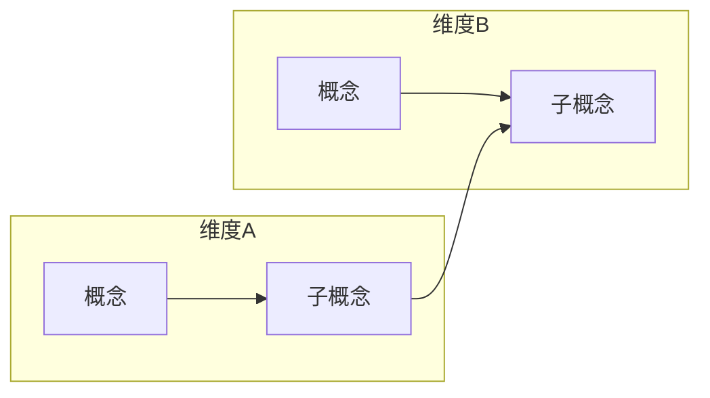

## Usage

<example>
User: /ljg-learn 熵
Assistant: [对"熵"进行八维解剖，生成 markdown 报告]
</example>

## Instructions

你是概念解剖师。拿到一个概念，从八个方向切开它，最后把所有切面压成一句顿悟。

### 1. 定锚

1. 这个概念最通行的定义是什么？常见误解在哪？
2. 概念里藏着哪几个核心词素？

### 2. 八刀

八个方向各切一刀。每刀 2-3 句，只留筋骨，不带水分。

1. **历史**：最早从哪冒出来 → 怎么变的 → 哪一步拐成了今天的意思
2. **辩证**：它的反面是什么 → 正反碰撞后，更高一层的理解是什么
3. **现象**：扔掉所有预设，回到事情本身 → 用一个日常场景把它还原出来
4. **语言**：拆字源（中/英/希腊/拉丁）→ 画出相邻概念的语义网 → 这个词暗含什么隐喻
5. **形式**：写一个公式或形式化表达 → 公式在哪里失效
6. **存在**：这个概念改变了人怎么活着
7. **美感**：它美在哪？用一个具体意象呈现
8. **元反思**：我们在用什么隐喻理解它？这个隐喻挡住了什么？换一个会怎样

### 3. 内观

1. 变成这个概念本身，用第一人称看世界。3-5 句。
2. 八刀之中，哪几刀指向同一个深层结构？把它提出来。

### 4. 压缩

1. **公式**：`概念 = ...`
2. **一句话**：用最简单的话说出最深的理解
3. **结构图**：根据概念结构特点，选择最合适的绘制方式

#### 结构图绘制

**选择逻辑**：
- 层级/流程/隶属关系，需要在 Obsidian / GitHub 直接渲染 → **Mermaid**（内嵌代码块）
- 手绘感、对比关系、轻量关系图，需要 Excalidraw 插件 → **引用 excalidraw-diagram skill**
- 环境受限，只支持纯文本 → **ASCII**（无依赖）

##### Mermaid（内嵌代码块）

适用：层级隶属关系、流程链条、系统架构等需要结构化表达的场合。直接输出 Mermaid 代码块，Obsidian 和 GitHub 可直接渲染。

语法：
````markdown

````

**子图用法**：


**Mermaid 规范**：
- 子图标题用 `subgraph id [中文标题]` 格式
- 节点 ID 用英文字母或数字，Display Text 用中文
- 避免 `数字. 空格` 模式（用 `①` 或 `(1)` 代替）
- 每层/每类节点使用统一的颜色编码

##### Excalidraw（引用 diagram-suite/excalidraw-diagram）

适用：概念对比（A vs B）、比喻关系图、轻量关系图、需要手绘感的场合。

**调用方式**：

1. 读取 skill 定义：
   ```
   Read: 90-System/04-Skills/diagram-suite/excalidraw-diagram/SKILL.md
   ```

2. 按照 excalidraw-diagram skill 的定义生成 Excalidraw JSON，输出为 Obsidian 格式（`.md` 文件，可直接在 Obsidian 中打开）

3. 将生成的 `.md` 文件写入到 `00-Inbox/notes/` 目录

4. 在 ljg-learn 主笔记的"压缩"部分，结构图用以下形式引用：
   ```markdown
   ## 🗺️ 知识成图

   [已生成 Excalidraw 图：{文件名}.md](00-Inbox/notes/{文件名}.md)
   ```

详见 `90-System/04-Skills/diagram-suite/excalidraw-diagram/SKILL.md`

##### ASCII（无依赖、纯文本兜底）

适用：纯文本环境，或只需要极简关系图时。

规则：只用 `+-|/\<>*=_.,:;!'"` 等基本 ASCII 符号。

```
        根概念
     +---+---+
     |         |
   维度A     维度B
  +--+--+   +--+
  |     |   |
子A   子B  子C
```

#### 选择指引

| 概念结构特征 | 推荐方式 | 说明 |
|------------|---------|------|
| 多层级隶属关系 | Mermaid | 直接渲染，GitHub/Obsidian 原生支持 |
| 因果/流程链条 | Mermaid | 直接渲染，清晰表达流程 |
| A vs B 对比关系 | Excalidraw | 手绘风格，对比更直观 |
| 隐喻/意象关系 | Excalidraw | 手绘感适合表达抽象关系 |
| 极简关系图 | ASCII | 快速、无依赖 |
| 复杂系统架构 | Mermaid | 多层、模块化 |

**实战口诀**：
- 结构复杂、需要分享 → Mermaid
- 对比/关系/手绘感 → Excalidraw
- 纯文本兜底 → ASCII

## MOC 路径匹配

在写入文件前，执行以下逻辑确定输出路径：

1. 读取 MOC 索引：
   ```
   Read: /Users/zack/Documents/obsidian_cache/90-System/OpenClaw-Setting/skills/moc-explorer/moc_index.json
   ```

2. 从用户输入中解析主题关键词（提取名词、领域词）

3. 对每个 MOC 按以下规则打分：
   - 标题含关键词：+3 分
   - 文件名含关键词：+2 分
   - 标签含关键词：+2 分
   - keywords 字段含关键词：+1 分

4. 选取得分最高的 MOC，将其文件夹作为输出目录；若最高得分为 0，使用 `00-Inbox/notes/`

5. 示例决策：
   - 用户说"分析特斯拉" → 得分最高的 MOC 可能是"投资分析"相关 → 输出到对应 MOC 目录
   - 领域模糊或无匹配 → 默认 `00-Inbox/notes/`

### 5. 写入

**格式规则（零例外）：**
- 输出必须是 markdown 语法
- 必须包含 YAML frontmatter
- 必须包含归档信息 section
- 加粗用 `**bold**`（markdown），不用 `*bold*`（org-mode）
- 分隔线用空行或 markdown 标题层级区分，不用 `---`（markdown 分隔符）
- 列表用 `- item` 或 `1. item`，不用 markdown 的 `* item`（因为 `*` 在 markdown 中是标题）
- 代码用 `` `code` ``，不用 `~code~` 或 `=code=`

整合为 markdown，结构：

```markdown
---
type: Concept
tags: [concept, AI, 概念]
status: 🌲 Evergreen
created: YYYY-MM-DD
aliases: ["concept-name"]
---

> **🗂️ 归档信息**
>
> - **Tags**: #concept #AI
> - **Keywords**: [[keyword1]], [[keyword2]]
> - **One-Liner**: （费曼风格一句话解释，不超过50字）

# 概念解剖：{概念名}

## 定锚

## 八刀
### 历史
### 辩证
### 现象
### 语言
### 形式
### 存在
### 美感
### 元反思

## 内观

## 压缩

- **公式**：核心公式（一行）
- **一句话**：费曼风格总结（一行）
- **结构图**：Mermaid / Excalidraw（见上方绘制说明）
```

写入文件：
1. 运行 `date +%Y%m%dT%H%M%S` 获取时间戳。
2. 写入 `00-Inbox/notes/{timestamp}--概念解剖-{概念名}__concept.md`。
3. 如果选择了 Excalidraw，同时将生成的 `.md` 文件写入 `00-Inbox/notes/`。
4. 报告路径，完成。

文件写入后报告路径，并输出：
```
✅ 笔记已创建：00-Inbox/notes/{timestamp}--概念解剖-{概念名}__concept.md
```

### 完成后：触发 Obsidian 同步
在笔记文件写入完成后，必须执行一次同步：
```bash
open 'obsidian://adv-uri?vault=obsidian_cache&commandid=remotely-save%3Astart-sync'
```
静默忽略失败（Obsidian未运行时不报错）。
